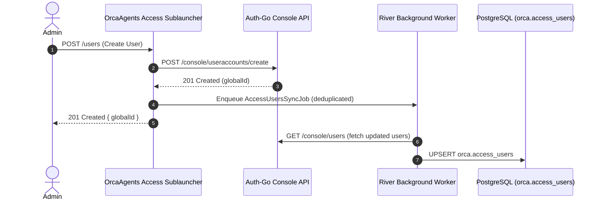

# Access Management Service

> User accounts, roles, sessions, MFA/TOTP management, and impersonation — proxied to auth-go's `/console/*` endpoints.

**Route prefix:** `/orcaagents/access`  
**Handler:** `handler/web/access_handler.go`  
**Auth required:** Yes (JWT)  
**Access level:** All endpoints require Admin (`SYSTEM_ADMIN` / `CUSTOMER_ADMIN`)

> **Prerequisites:** All examples use the shared [`orcaFetch`](../SKILL.md#31-fetch-wrapper-orcafetch) wrapper and [`headers()`](../SKILL.md#31-fetch-wrapper-orcafetch) helper from the [root skill](../SKILL.md). Import or define them once before calling any endpoint.

---

## 1. Endpoints

### User CRUD

| Method | Path | OperationID | Description |
|--------|------|-------------|-------------|
| `GET` | `/orcaagents/access/users` | `listUsers` | List all user accounts with customer associations |
| `POST` | `/orcaagents/access/users/search` | `searchUsers` | Search user accounts with filters & pagination |
| `GET` | `/orcaagents/access/users/{userId}` | `getUser` | Get single user account by ID (includes MFA status) |
| `POST` | `/orcaagents/access/users` | `createUser` | Create a new user account |
| `PATCH` | `/orcaagents/access/users` | `updateUser` | Update user account info (email, name, state, SCIM flag) |
| `POST` | `/orcaagents/access/users/password` | `setPassword` | Set user password by globalId |

### MFA / TOTP

| Method | Path | OperationID | Description |
|--------|------|-------------|-------------|
| `GET` | `/orcaagents/access/users/{userId}/totp` | `hasTOTP` | Check if user has TOTP/MFA configured |
| `DELETE` | `/orcaagents/access/users/{userId}/totp` | `removeTOTP` | Remove user TOTP/MFA configuration |

### Impersonation

| Method | Path | OperationID | Description |
|--------|------|-------------|-------------|
| `POST` | `/orcaagents/access/users/{userId}/loginas` | `loginAs` | Generate impersonation token (highest-privilege operation) |

### Roles

| Method | Path | OperationID | Description |
|--------|------|-------------|-------------|
| `GET` | `/orcaagents/access/roles` | `listRoles` | List all available roles |
| `POST` | `/orcaagents/access/roles` | `createRole` | Create a custom role |
| `DELETE` | `/orcaagents/access/roles/{roleId}` | `deleteRole` | Delete a custom role and its member assignments |
| `GET` | `/orcaagents/access/roles/{roleId}/members` | `listMembersForRole` | List members of a role in a workspace (query: `workspaceId`) |
| `GET` | `/orcaagents/access/workspaces/{workspaceId}/rolemembers` | `listRoleMembers` | List all role member assignments for a workspace |
| `GET` | `/orcaagents/access/workspaces/{workspaceId}/users/{userId}/roles` | `listRolesForUser` | List roles assigned to a user in a workspace |
| `POST` | `/orcaagents/access/workspaces/{workspaceId}/users/{userId}/roles` | `addRole` | Add a role to a user (non-assignable: SYSTEM_ADMIN) |
| `DELETE` | `/orcaagents/access/workspaces/{workspaceId}/users/{userId}/roles/{roleId}` | `removeRoleFromUser` | Remove a role assignment from a user |

### Sessions

| Method | Path | OperationID | Description |
|--------|------|-------------|-------------|
| `GET` | `/orcaagents/access/sessions` | `listSessions` | List all active sessions in the workspace |
| `GET` | `/orcaagents/access/users/{userId}/sessions` | `listSessionsByUser` | List active sessions for a specific user |
| `GET` | `/orcaagents/access/customers/{customerId}/sessions` | `listSessionsByCustomer` | List active sessions for a customer |

---

## 2. Architecture & Workflow



All 20 endpoints are proxied to auth-go's `/console/*` management routes via `service/authclient`. User mutations (create, update, setPassword, removeTOTP) trigger a background `AccessUsersSyncJob` to keep the local `orca.access_users` cache current.

---

## 3. TypeScript Interfaces

```ts
// --- Response types ---

export interface UserAccount {
  userAccountId: number;
  email: string;
  globalId: string; // UUID
  state: "ACTIVE" | "DISABLED";
  firstname?: string;
  lastname?: string;
  created: string; // ISO 8601
  updated: string;
  requirePasswordChange: boolean;
  scimManaged: boolean;
}

export interface UserAccountWithMFA extends UserAccount {
  mfaTotpEnabled: boolean;
}

export interface UserCustomer {
  userAccountId: number;
  customerId: number;
  state: "ACTIVE" | "DISABLED";
  userAccount?: UserAccount;
  customer?: { customerId: number; name: string };
}

export interface Role {
  roleId: number;
  name: string;
  description: string;
  builtin: boolean;
}

export interface RoleMember {
  roleMemberId: number;
  roleId: number;
  roleName: string;
  userAccountId: number;
  workspaceId: number;
  email?: string;
}

export interface SessionInfo {
  sessionId: string; // UUID
  userAccountId: number;
  clientOrigin: string;
  createdAt: string; // ISO 8601
  destroyedAt?: string;
  email: string;
  customer: string;
  appId: string;
}

export interface LoginAsResponse {
  appRedirectUrl: string;
}

export interface SearchUsersResponse {
  items: UserCustomer[];
  pageKey?: string;
}

// --- Request types ---

export interface CreateUserRequest {
  email: string;
  password: string;
  firstname?: string;
  lastname?: string;
  customerId?: number;
  workspaceId?: number;
}

export interface UpdateUserRequest {
  globalId: string; // UUID
  email?: string;
  firstname?: string;
  lastname?: string;
  state?: "ACTIVE" | "DISABLED";
  scimManaged?: boolean;
}

export interface SetPasswordRequest {
  globalId: string; // UUID
  password: string;
}

export interface SearchUsersRequest {
  filters: Array<{ key: string; value: string }>;
  size?: number;
  pageKey?: string;
}

export interface CreateRoleRequest {
  name: string;
  description?: string;
  workspaceId?: number;
}

export interface AddRoleRequest {
  roleId: number;
}

export interface LoginAsRequest {
  assumedBy: string;
  customerId?: number;
}

export interface OkResponse {
  status: "ok";
}
```

---

## 4. Client Functions

```ts
import { orcaFetch, headers } from "../SKILL.md#31-fetch-wrapper-orcafetch";

export const accessClient = {
  // --- Users ---

  async listUsers(): Promise<UserCustomer[]> {
    const res = await orcaFetch("/orcaagents/access/users", { credentials: "include" });
    if (!res.ok) { const err = await res.json(); throw new Error(err.error || "Failed to list users"); }
    return res.json();
  },

  async searchUsers(req: SearchUsersRequest): Promise<SearchUsersResponse> {
    const res = await orcaFetch("/orcaagents/access/users/search", {
      method: "POST", headers: headers(), credentials: "include", body: JSON.stringify(req),
    });
    if (!res.ok) { const err = await res.json(); throw new Error(err.error || "Failed to search users"); }
    return res.json();
  },

  async getUser(userId: number): Promise<UserAccountWithMFA> {
    const res = await orcaFetch(`/orcaagents/access/users/${userId}`, { credentials: "include" });
    if (!res.ok) { const err = await res.json(); throw new Error(err.error || "Failed to get user"); }
    return res.json();
  },

  async createUser(req: CreateUserRequest): Promise<{ globalId: string }> {
    const res = await orcaFetch("/orcaagents/access/users", {
      method: "POST", headers: headers(), credentials: "include", body: JSON.stringify(req),
    });
    if (!res.ok) { const err = await res.json(); throw new Error(err.error || "Failed to create user"); }
    return res.json();
  },

  async updateUser(req: UpdateUserRequest): Promise<OkResponse> {
    const res = await orcaFetch("/orcaagents/access/users", {
      method: "PATCH", headers: headers(), credentials: "include", body: JSON.stringify(req),
    });
    if (!res.ok) { const err = await res.json(); throw new Error(err.error || "Failed to update user"); }
    return res.json();
  },

  async setPassword(req: SetPasswordRequest): Promise<OkResponse> {
    const res = await orcaFetch("/orcaagents/access/users/password", {
      method: "POST", headers: headers(), credentials: "include", body: JSON.stringify(req),
    });
    if (!res.ok) { const err = await res.json(); throw new Error(err.error || "Failed to set password"); }
    return res.json();
  },

  // --- MFA ---

  async hasTOTP(userId: number): Promise<{ hasTOTP: boolean }> {
    const res = await orcaFetch(`/orcaagents/access/users/${userId}/totp`, { credentials: "include" });
    if (!res.ok) { const err = await res.json(); throw new Error(err.error || "Failed to check TOTP"); }
    return res.json();
  },

  async removeTOTP(userId: number): Promise<OkResponse> {
    const res = await orcaFetch(`/orcaagents/access/users/${userId}/totp`, {
      method: "DELETE", credentials: "include",
    });
    if (!res.ok) { const err = await res.json(); throw new Error(err.error || "Failed to remove TOTP"); }
    return res.json();
  },

  // --- Impersonation ---

  async loginAs(userId: number, req: LoginAsRequest): Promise<LoginAsResponse> {
    const res = await orcaFetch(`/orcaagents/access/users/${userId}/loginas`, {
      method: "POST", headers: headers(), credentials: "include", body: JSON.stringify(req),
    });
    if (!res.ok) { const err = await res.json(); throw new Error(err.error || "Failed to login as user"); }
    return res.json();
  },

  // --- Roles ---

  async listRoles(): Promise<Role[]> {
    const res = await orcaFetch("/orcaagents/access/roles", { credentials: "include" });
    if (!res.ok) { const err = await res.json(); throw new Error(err.error || "Failed to list roles"); }
    return res.json();
  },

  async createRole(req: CreateRoleRequest): Promise<Role> {
    const res = await orcaFetch("/orcaagents/access/roles", {
      method: "POST", headers: headers(), credentials: "include", body: JSON.stringify(req),
    });
    if (!res.ok) { const err = await res.json(); throw new Error(err.error || "Failed to create role"); }
    return res.json();
  },

  async deleteRole(roleId: number): Promise<OkResponse> {
    const res = await orcaFetch(`/orcaagents/access/roles/${roleId}`, {
      method: "DELETE", credentials: "include",
    });
    if (!res.ok) { const err = await res.json(); throw new Error(err.error || "Failed to delete role"); }
    return res.json();
  },

  async addRole(workspaceId: number, userId: number, req: AddRoleRequest): Promise<RoleMember> {
    const res = await orcaFetch(
      `/orcaagents/access/workspaces/${workspaceId}/users/${userId}/roles`,
      { method: "POST", headers: headers(), credentials: "include", body: JSON.stringify(req) },
    );
    if (!res.ok) { const err = await res.json(); throw new Error(err.error || "Failed to add role"); }
    return res.json();
  },

  async removeRoleFromUser(workspaceId: number, userId: number, roleId: number): Promise<OkResponse> {
    const res = await orcaFetch(
      `/orcaagents/access/workspaces/${workspaceId}/users/${userId}/roles/${roleId}`,
      { method: "DELETE", credentials: "include" },
    );
    if (!res.ok) { const err = await res.json(); throw new Error(err.error || "Failed to remove role"); }
    return res.json();
  },

  // --- Sessions ---

  async listSessions(): Promise<SessionInfo[]> {
    const res = await orcaFetch("/orcaagents/access/sessions", { credentials: "include" });
    if (!res.ok) { const err = await res.json(); throw new Error(err.error || "Failed to list sessions"); }
    return res.json();
  },

  async listSessionsByUser(userId: number): Promise<SessionInfo[]> {
    const res = await orcaFetch(`/orcaagents/access/users/${userId}/sessions`, { credentials: "include" });
    if (!res.ok) { const err = await res.json(); throw new Error(err.error || "Failed to list user sessions"); }
    return res.json();
  },

  async listSessionsByCustomer(customerId: number): Promise<SessionInfo[]> {
    const res = await orcaFetch(`/orcaagents/access/customers/${customerId}/sessions`, { credentials: "include" });
    if (!res.ok) { const err = await res.json(); throw new Error(err.error || "Failed to list customer sessions"); }
    return res.json();
  },
};
```

---

## 5. Query & Path Parameters

| Parameter | Type | Required | Description |
|-----------|------|----------|-------------|
| `userId` | `number` | Yes | User account ID (path param) |
| `roleId` | `number` | Yes | Role ID (path param) |
| `workspaceId` | `number` | Yes | Workspace ID (path param, must match JWT claims) |
| `customerId` | `number` | Yes | Customer ID (path param) |
| `workspaceId` | `number` | Yes (query) | Required query param for `listMembersForRole` |

---

## 6. SSE Streaming / Binary Payloads

Not applicable — this service returns JSON only.

---

## 7. Error Scenarios

| Status | Condition | Mitigation / Resolution |
|--------|-----------|-------------------------|
| `400` | Missing email or malformed request body | Check request payload schema |
| `401` | Unauthorized | Provide valid admin JWT token |
| `403` | Non-admin user or workspace ID mismatch | Ensure user has `CUSTOMER_ADMIN` or `SYSTEM_ADMIN` role; SYSTEM_ADMIN role cannot be assigned via addRole |
| `404` | User, role, or session not found | Verify ID exists |
| `502` | Auth-go upstream request failed | Verify auth-go is reachable; check backend logs |
