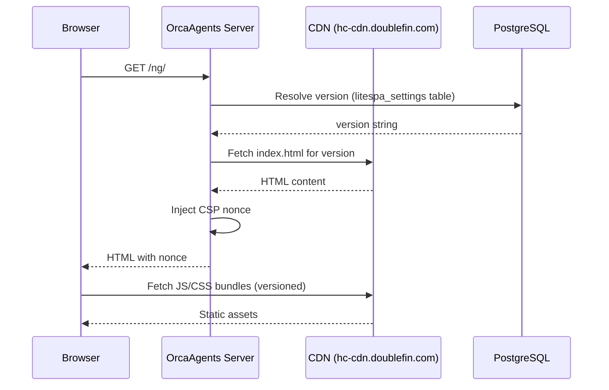

# Frontend Service

> CDN-hosted React 19 SPA serving layer — version resolution from PostgreSQL, CSP nonce injection, and runtime version refresh.

**Route prefix:** `/ng`  
**Handler:** `handler/web/frontend_handler.go`  
**Auth required:** No (SPA is unauthenticated; API calls within the SPA use JWT)  
**Access level:** Public (SPA serving); version refresh requires JWT

> **Note:** The frontend sublauncher serves built static assets from a CDN, not REST APIs. This guide documents the serving layer for deployment and operations teams.

---

## 1. Endpoints

| Method | Path | Auth | Description |
|--------|------|------|-------------|
| `GET` | `/ng` | No | Serve SPA root (`index.html`) from CDN |
| `GET` | `/ng/*` | No | Serve allow-listed static files or SPA fallback (`index.html`) |
| `POST` | `/ng/fever/refresh/db` | Yes (JWT) | Refresh frontend version from database or set a specific version |

---

## 2. Architecture & Workflow



### Version Resolution

1. If `FRONTEND_VERSION` env var is set, use it (locked version).
2. Otherwise, read `frontend.version` from the `litespa_settings` table.
3. Fall back to a compiled-in default version.

### Static File Allow-List

Only these files are served directly from the CDN (besides `index.html`):
- `/unsubscribed.html`
- `/tui-editor.png`
- `/tui-editor-2x.png`
- Any paths in `FRONTEND_STATIC_FILE_PATHS` env var

All other paths under `/ng/` return `index.html` (SPA client-side routing).

---

## 3. TypeScript Interfaces

```ts
/** Payload for POST /ng/fever/refresh/db */
export interface FeverRefreshPayload {
  /** Optional specific version to set. Omit to refresh from DB. */
  fever?: string;
}
```

---

## 4. Client Functions

```ts
import { orcaFetch } from "../SKILL.md#31-fetch-wrapper-orcafetch";

export const frontendClient = {
  /**
   * Refresh the frontend version from the database.
   * Requires JWT authentication.
   */
  async refreshVersion(): Promise<string> {
    const res = await orcaFetch("/ng/fever/refresh/db", {
      method: "POST",
      credentials: "include",
    });
    if (!res.ok) {
      const err = await res.json();
      throw new Error(err.error || "Failed to refresh frontend version");
    }
    return res.text(); // Returns "OK"
  },

  /**
   * Set a specific frontend version and flush cache.
   * Requires JWT authentication.
   */
  async setVersion(version: string): Promise<string> {
    const res = await orcaFetch("/ng/fever/refresh/db", {
      method: "POST",
      headers: { "Content-Type": "application/json" },
      credentials: "include",
      body: JSON.stringify({ fever: version }),
    });
    if (!res.ok) {
      const err = await res.json();
      throw new Error(err.error || "Failed to set frontend version");
    }
    return res.text();
  },
};
```

---

## 5. Query & Path Parameters

| Parameter | Type | Required | Description |
|-----------|------|----------|-------------|
| `fever` | `string` | No | Specific version string to deploy (body param for refresh endpoint) |

---

## 6. Version Refresh Lifecycle

### How `POST /ng/fever/refresh/db` Works

1. **With `{"fever": "<version>"}` body:** Validates the version exists in the CDN, persists it to `litespa_settings`, flushes the in-memory page cache, and updates the version provider. Returns `422` if the version is invalid or unpublished.
2. **Without body (or empty body):** Re-reads the current version from `litespa_settings` and flushes the in-memory page cache.

### Cache Invalidation & Propagation

- The server maintains an in-memory cache of the resolved `index.html` content. `FlushCache` is triggered automatically via the `OnChange` callback whenever the version changes.
- Version changes take effect **immediately** for subsequent requests to the same server instance.
- In multi-instance deployments, each instance must be refreshed independently (the `POST` only affects the receiving instance). Consider calling the refresh endpoint on all instances via a load-balancer fan-out or a rolling restart.

---

## 7. Error Scenarios

| Status | Condition | Mitigation / Resolution |
|--------|-----------|-------------------------|
| `401` | Unauthorized (refresh endpoint) | Include valid JWT in request |
| `422` | Invalid or unpublished version | Verify the version exists in the CDN |
| `500` | Database unavailable | Check `litespa_settings` table accessibility |

---

## 8. Environment Variables

| Variable | Default | Description |
|----------|---------|-------------|
| `FRONTEND_CDN_PREFIX` | `https://hc-cdn.doublefin.com` | CDN base URL |
| `FRONTEND_VERSION` | *(unset)* | Locks frontend to a specific version (bypasses DB resolution) |
| `FRONTEND_STATIC_FILE_PATHS` | *(empty)* | Comma-separated extra allow-listed static paths |
