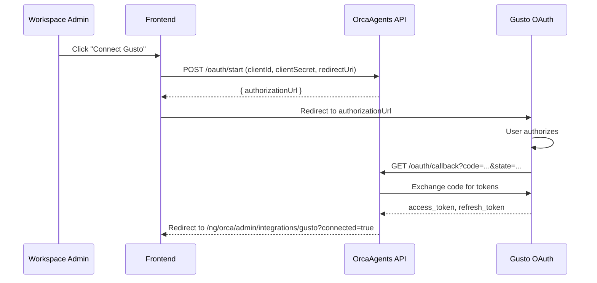

# Gusto Service

> Workspace-scoped Gusto HRIS integration — OAuth2 connection flow, and employee retrieval.

**Route prefix:** `/orcaagents/gusto`  
**Handler:** `handler/web/gusto_handler.go`  
**Auth required:** Yes (JWT) for all endpoints except the OAuth callback  
**Access level:** Connection management requires Workspace Admin; employee queries require Authenticated User

> **Prerequisites:** All examples use the shared [`orcaFetch`](../SKILL.md#31-fetch-wrapper-orcafetch) wrapper and [`headers()`](../SKILL.md#31-fetch-wrapper-orcafetch) helper from the [root skill](../SKILL.md). Import or define them once before calling any endpoint.

---

## 1. Endpoints

| Method | Path | OperationID | Description |
|--------|------|-------------|-------------|
| `GET` | `/orcaagents/gusto/connection` | `getGustoConnection` | Get Gusto connection status |
| `DELETE` | `/orcaagents/gusto/connection` | `deleteGustoConnection` | Remove workspace Gusto connection (admin) |
| `POST` | `/orcaagents/gusto/oauth/start` | `startGustoOAuth` | Start OAuth flow — returns authorization URL (admin) |
| `GET` | `/orcaagents/gusto/oauth/callback` | *(raw mux)* | OAuth callback — JWT-exempt, Gusto redirects here |
| `GET` | `/orcaagents/gusto/employees` | `listGustoEmployees` | List Gusto employees |
| `GET` | `/orcaagents/gusto/employees/{id}` | `getGustoEmployee` | Get a single Gusto employee by UUID |

---

## 2. Architecture & Workflow

Gusto uses an **OAuth 2.0 authorization code flow** instead of direct API key authentication.



---

## 3. TypeScript Interfaces

```ts
export interface GustoOAuthStartRequest {
  companyUuid?: string;
  clientId: string;
  clientSecret: string;
  environment: string;
  redirectUri: string;
}

export interface GustoOAuthStartResponse {
  authorizationUrl: string;
}

export interface GustoConnectionResponse {
  connected: boolean;
  companyUuid?: string;
  clientId?: string;
  environment?: string;
  connectedAt?: string; // ISO 8601
  connectedBy?: string;
}

export interface GustoEmployee {
  id: string;
  firstName: string;
  lastName: string;
  workEmail: string;
  jobTitle: string;
  department: string;
  hireDate: string;
  status: string;
}

export interface OkResponse {
  status: "ok";
}
```

---

## 4. Client Functions

```ts
import { orcaFetch, headers } from "../SKILL.md#31-fetch-wrapper-orcafetch";

export const gustoClient = {
  async getConnection(): Promise<GustoConnectionResponse> {
    const res = await orcaFetch("/orcaagents/gusto/connection", {
      credentials: "include",
    });
    if (!res.ok) {
      const err = await res.json();
      throw new Error(err.error || "Failed to get Gusto connection");
    }
    return res.json();
  },

  async deleteConnection(): Promise<OkResponse> {
    const res = await orcaFetch("/orcaagents/gusto/connection", {
      method: "DELETE",
      credentials: "include",
    });
    if (!res.ok) {
      const err = await res.json();
      throw new Error(err.error || "Failed to delete Gusto connection");
    }
    return res.json();
  },

  async startOAuth(req: GustoOAuthStartRequest): Promise<GustoOAuthStartResponse> {
    const res = await orcaFetch("/orcaagents/gusto/oauth/start", {
      method: "POST",
      headers: headers(),
      credentials: "include",
      body: JSON.stringify(req),
    });
    if (!res.ok) {
      const err = await res.json();
      throw new Error(err.error || "Failed to start Gusto OAuth");
    }
    return res.json();
  },

  async listEmployees(): Promise<GustoEmployee[]> {
    const res = await orcaFetch("/orcaagents/gusto/employees", {
      credentials: "include",
    });
    if (!res.ok) {
      const err = await res.json();
      throw new Error(err.error || "Failed to list Gusto employees");
    }
    return res.json();
  },

  async getEmployee(id: string): Promise<GustoEmployee> {
    const res = await orcaFetch(`/orcaagents/gusto/employees/${encodeURIComponent(id)}`, {
      credentials: "include",
    });
    if (!res.ok) {
      const err = await res.json();
      throw new Error(err.error || "Failed to get Gusto employee");
    }
    return res.json();
  },
};
```

---

## 5. Query & Path Parameters

| Parameter | Type | Required | Description |
|-----------|------|----------|-------------|
| `id` | `string` | Yes | Gusto employee UUID |

---

## 6. SSE Streaming / Binary Payloads

Not applicable — this service returns JSON only. The OAuth callback is a browser redirect (HTTP 302).

---

## 7. Error Scenarios

| Status | Condition | Mitigation / Resolution |
|--------|-----------|-------------------------|
| `400` | Missing clientId, clientSecret, or redirectUri | Provide all required OAuth fields |
| `401` | Unauthorized | Refresh JWT session |
| `403` | Forbidden (admin endpoints) | Verify user has Workspace Admin role |
| `500` | Internal server error | Check backend logs |
| `502` | Gusto upstream request failed | Verify Gusto is reachable and tokens are valid |
| `503` | Gusto not connected | Complete the OAuth flow first |

### OAuth Callback Errors

The `/oauth/callback` endpoint redirects back to the frontend with query params on error:

| Redirect | Meaning |
|----------|---------|
| `?error=<provider-error>` | Gusto returned an OAuth error |
| `?error=missing_code` | Missing code or state in callback |
| `?error=invalid_state` | Unknown or expired state parameter |
| `?error=token_exchange_failed` | Code-to-token exchange failed |
| `?error=save_failed` | Token persistence failed |
| `?connected=true` | Success |
