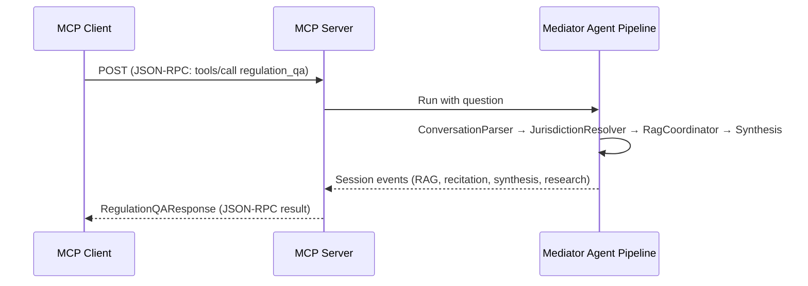

# MCP Service

> Model Context Protocol (MCP) streamable HTTP endpoint exposing the mediator agent pipeline as a structured tool for AI agents and programmatic clients.

**Route prefix:** `/orcaagents/mcp`  
**Handler:** `handler/web/mcp_handler.go`  
**Auth required:** Yes (JWT via Bearer token — CSRF intentionally excluded for programmatic clients)  
**Access level:** Authenticated User

> **Prerequisites:** MCP clients use the standard MCP streamable HTTP transport with Bearer-token auth. This is not a traditional REST API — it follows the [Model Context Protocol](https://modelcontextprotocol.io/) specification.

---

## 1. Endpoints

| Method | Path | Protocol | Description |
|--------|------|----------|-------------|
| `POST` | `/orcaagents/mcp` | MCP Streamable HTTP | MCP JSON-RPC endpoint (tool calls, initialization) |
| `GET` | `/orcaagents/mcp` | MCP Streamable HTTP | SSE stream for server-initiated messages |
| `DELETE` | `/orcaagents/mcp` | MCP Streamable HTTP | Session termination |

### Available Tools

| Tool Name | Description |
|-----------|-------------|
| `regulation_qa` | Ask a regulatory compliance question; returns structured RAG results, recitation, synthesis, and optional web research |

---

## 2. Architecture & Workflow



### Dispatch Contract

The `regulation_qa` tool collects events from the mediator agent pipeline and maps them to response fields:

| Event Author | Response Field | Notes |
|---|---|---|
| `rag-lite-*` | `ragResults[author]` | Per-jurisdiction RAG results with citations |
| `recitation-*` | `recitationResults[author]` | Revised citations per jurisdiction |
| `synthesis-*` | `ragSynthesisResult` | Synthesized answer text (last-writer-wins) |
| `mediator` (research-node branch) | `researchResult` | Web research text (last-writer-wins) |

---

## 3. TypeScript Interfaces

```ts
export interface RegulationQAToolArgs {
  question: string;     // Required — max 10,000 characters
  sessionID?: string;   // Optional — omit to start a new session
}

export interface RagLiteCitation {
  filename: string;
  section: string;
  section_title: string;
  answer_start_words: string;
  answer_end_words: string;
  answer_text: string;
  cited_text: string;
}

export interface RagLiteOutput {
  answer: string;
  citations: RagLiteCitation[];
}

export interface RecitationOutput {
  revised_citations: RagLiteCitation[];
}

export interface RegulationQAResponse {
  ragResults: Record<string, RagLiteOutput>;
  recitationResults: Record<string, RecitationOutput>;
  ragSynthesisResult: string;
  researchResult: string;
  errors?: string[];    // Populated on mid-stream errors; partial results may coexist
}
```

---

## 4. Client Functions

### Using the `mcp-go` Client (Recommended)

```go
import (
    "github.com/mark3labs/mcp-go/client"
    "github.com/mark3labs/mcp-go/client/transport"
)

// Create a streamable HTTP client with Bearer auth.
opts := []transport.StreamableHTTPCOption{
    transport.WithHTTPHeaders(map[string]string{
        "Authorization": "Bearer " + jwtToken,
    }),
}
c, err := client.NewStreamableHttpClient(serverURL+"/orcaagents/mcp", opts...)

// Call the regulation_qa tool.
result, err := c.CallTool(ctx, "regulation_qa", map[string]any{
    "question": "What are the FLSA overtime rules?",
})
```

### Using Plain HTTP (MCP JSON-RPC)

```ts
const MCP_URL = "/orcaagents/mcp";

async function callRegulationQA(question: string, sessionID?: string): Promise<RegulationQAResponse> {
  // MCP JSON-RPC request
  const body = {
    jsonrpc: "2.0",
    id: crypto.randomUUID(),
    method: "tools/call",
    params: {
      name: "regulation_qa",
      arguments: { question, sessionID },
    },
  };

  const res = await fetch(MCP_URL, {
    method: "POST",
    headers: {
      "Content-Type": "application/json",
      "Authorization": `Bearer ${jwtToken}`,
    },
    body: JSON.stringify(body),
  });

  if (!res.ok) throw new Error(`MCP request failed: ${res.status}`);
  const json = await res.json();
  // Extract the structured result from the MCP response
  const content = JSON.parse(json.result.content[0].text);
  return content as RegulationQAResponse;
}
```

---

## 5. Query & Path Parameters

Not applicable — MCP uses JSON-RPC over HTTP POST.

---

## 6. SSE Streaming / Session Lifecycle

### Session Creation & Resumption

Each `regulation_qa` call accepts an optional `sessionID`. When omitted, the server creates a new ADK session (backed by Firestore) and returns the generated ID. Pass a previously returned `sessionID` to resume the same conversational context.

### MCP Transport Endpoints

| Method | Purpose |
|--------|---------|
| `POST /orcaagents/mcp` | JSON-RPC requests (initialize, tools/call, etc.) |
| `GET /orcaagents/mcp` | SSE stream for server-initiated notifications (progress, pings) |
| `DELETE /orcaagents/mcp` | Terminate the MCP session |

Standard MCP streamable HTTP clients manage the `GET` SSE stream and `DELETE` teardown automatically. If you are building a raw HTTP client:

1. Open the SSE stream (`GET`) after a successful `initialize` handshake.
2. Listen for server notifications (e.g. progress updates during long agent runs).
3. Send `DELETE` when the client no longer needs the session to release server-side resources.

### Server-Side Session Timeout

Agent runs are bounded by a 5-minute context timeout. If the agent pipeline exceeds this limit, the run is cancelled and partial results are returned alongside an error in the `errors` array. The MCP session itself persists in Firestore until explicitly terminated or expired by the server.

---

## 7. Error Scenarios

| Status | Condition | Mitigation / Resolution |
|--------|-----------|-------------------------|
| `400` | Malformed JSON-RPC or invalid tool arguments | Check request against MCP spec; `question` is required |
| `400` | Question too long (>10,000 characters) | Truncate or summarize the question |
| `401` | Missing or invalid JWT | Include a valid `Authorization: Bearer <token>` header |
| `500` | Agent run failed | Check `errors` field in partial response; inspect backend logs |
| Tool error | `isError: true` in MCP result | The tool returns errors as MCP tool results, not HTTP errors |

### Partial Results

When the agent pipeline encounters a mid-stream error, the response includes both partial results (from events that succeeded) and error messages in the `errors` array. Always check `errors` even when `ragResults` or other fields are populated.
