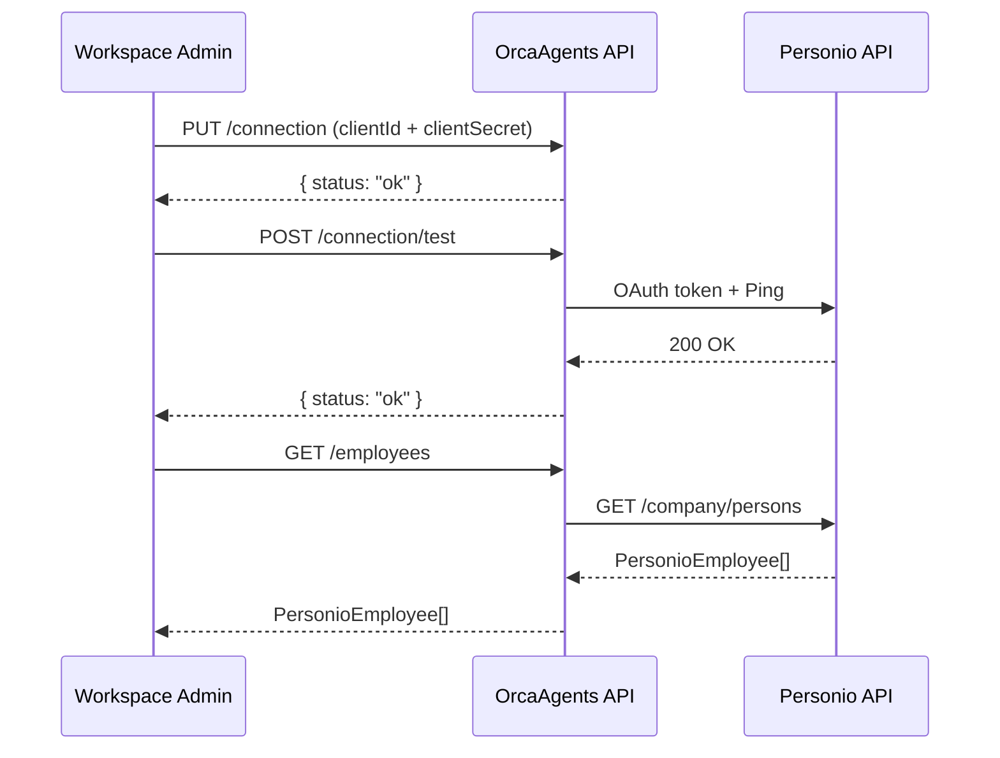

# Personio Service

> Workspace-scoped Personio HRIS integration — connection management, credential testing, and employee retrieval.

**Route prefix:** `/orcaagents/personio`  
**Handler:** `handler/web/personio_handler.go`  
**Auth required:** Yes (JWT)  
**Access level:** Connection management requires Workspace Admin; employee queries require Authenticated User

> **Prerequisites:** All examples use the shared [`orcaFetch`](../SKILL.md#31-fetch-wrapper-orcafetch) wrapper and [`headers()`](../SKILL.md#31-fetch-wrapper-orcafetch) helper from the [root skill](../SKILL.md). Import or define them once before calling any endpoint.

---

## 1. Endpoints

| Method | Path | OperationID | Description |
|--------|------|-------------|-------------|
| `GET` | `/orcaagents/personio/connection` | `getPersonioConnection` | Get Personio connection status |
| `PUT` | `/orcaagents/personio/connection` | `savePersonioConnection` | Create or replace workspace Personio connection (admin) |
| `DELETE` | `/orcaagents/personio/connection` | `deletePersonioConnection` | Remove workspace Personio connection (admin) |
| `POST` | `/orcaagents/personio/connection/test` | `testPersonioConnection` | Verify client credentials can reach Personio (admin) |
| `GET` | `/orcaagents/personio/employees` | `listPersonioEmployees` | List Personio employees |
| `GET` | `/orcaagents/personio/employees/{id}` | `getPersonioEmployee` | Get a single Personio employee by ID |

---

## 2. Architecture & Workflow



### Connection Lifecycle

State transitions: `disconnected` → `connected` (PUT) → `verified` (POST /test) → `disconnected` (DELETE).

- **DELETE is idempotent**: safe to call when already disconnected.
- **In-flight queries during DELETE**: may return `502` or `503`; clients should retry after reconnect.
- **Reconnection**: call PUT with new or same credentials. No UI cache is auto-invalidated — refetch connection status after PUT.
- **Stale UI state**: after DELETE, a client holding `connected: true` will receive `503` on employee queries until a new connection is saved.

---

## 3. TypeScript Interfaces

```ts
export interface PersonioConnectionRequest {
  clientId: string;
  clientSecret: string;
}

export interface PersonioConnectionResponse {
  connected: boolean;
  connectedAt?: string; // ISO 8601
  connectedBy?: string;
}

export interface PersonioEmployee {
  id: string;
  firstName: string;
  lastName: string;
  workEmail: string;
  jobTitle: string;
  department: string;
  hireDate: string;
  site: string;
  managerEmail: string;
}

export interface OkResponse {
  status: "ok";
}
```

---

## 4. Client Functions

```ts
import { orcaFetch, headers } from "../SKILL.md#31-fetch-wrapper-orcafetch";

export const personioClient = {
  async getConnection(): Promise<PersonioConnectionResponse> {
    const res = await orcaFetch("/orcaagents/personio/connection", {
      credentials: "include",
    });
    if (!res.ok) {
      const err = await res.json();
      throw new Error(err.error || "Failed to get Personio connection");
    }
    return res.json();
  },

  async saveConnection(req: PersonioConnectionRequest): Promise<OkResponse> {
    const res = await orcaFetch("/orcaagents/personio/connection", {
      method: "PUT",
      headers: headers(),
      credentials: "include",
      body: JSON.stringify(req),
    });
    if (!res.ok) {
      const err = await res.json();
      throw new Error(err.error || "Failed to save Personio connection");
    }
    return res.json();
  },

  async deleteConnection(): Promise<OkResponse> {
    const res = await orcaFetch("/orcaagents/personio/connection", {
      method: "DELETE",
      credentials: "include",
    });
    if (!res.ok) {
      const err = await res.json();
      throw new Error(err.error || "Failed to delete Personio connection");
    }
    return res.json();
  },

  async testConnection(req: PersonioConnectionRequest): Promise<OkResponse> {
    const res = await orcaFetch("/orcaagents/personio/connection/test", {
      method: "POST",
      headers: headers(),
      credentials: "include",
      body: JSON.stringify(req),
    });
    if (!res.ok) {
      const err = await res.json();
      throw new Error(err.error || "Personio connection test failed");
    }
    return res.json();
  },

  async listEmployees(): Promise<PersonioEmployee[]> {
    const res = await orcaFetch("/orcaagents/personio/employees", {
      credentials: "include",
    });
    if (!res.ok) {
      const err = await res.json();
      throw new Error(err.error || "Failed to list Personio employees");
    }
    return res.json();
  },

  async getEmployee(id: string): Promise<PersonioEmployee> {
    const res = await orcaFetch(`/orcaagents/personio/employees/${encodeURIComponent(id)}`, {
      credentials: "include",
    });
    if (!res.ok) {
      const err = await res.json();
      throw new Error(err.error || "Failed to get Personio employee");
    }
    return res.json();
  },
};
```

---

## 5. Query & Path Parameters

| Parameter | Type | Required | Description |
|-----------|------|----------|-------------|
| `id` | `string` | Yes | Personio employee identifier |

---

## 6. SSE Streaming / Binary Payloads

Not applicable — this service returns JSON only.

---

## 7. Error Scenarios

| Status | Condition | Mitigation / Resolution |
|--------|-----------|-------------------------|
| `400` | Missing clientId or clientSecret | Provide both fields in the request body |
| `400` | Connection test failed | Verify client credentials in Personio developer settings |
| `401` | Unauthorized | Refresh JWT session |
| `403` | Forbidden (admin endpoints) | Verify user has Workspace Admin role |
| `500` | Internal server error | Check backend logs |
| `502` | Personio upstream request failed | Verify Personio is reachable and credentials are valid |
| `503` | Personio not connected | Save a connection first via PUT /connection |
